# 성장판 세포 분류 프로젝트 — 연구일지 정리본

> **날짜:** 2026년 2월 23일
> **목적:** 쥐(마우스) tibia 조직의 성장판(growth plate) 내 세포를 머신러닝으로 자동 분류

---

## 0. 연구 배경 및 목표

성장판(growth plate) 연구에서는 각 zone 내 세포(chondrocyte) 수를 정확하게 파악하는 것이 매우 중요하다. 세포 수와 비율 변화는 골 성장 이상, 질환 모델, 약물 효과 분석 등 다양한 연구에서 핵심 지표로 활용된다.

그러나 현재까지 이 과정은 연구자가 현미경 조직 사진을 보면서 **수작업으로 세포를 하나씩 세고 분류**하는 방식에 의존하고 있다. 이는 시간 소모가 크고, 연구자 간 주관적 판단 차이로 인한 오차가 발생할 수 있으며, 대규모 데이터 분석에는 근본적으로 한계가 있다.

**본 연구의 목표:** 머신러닝을 활용하여 성장판 내 세포를 자동으로 분류하는 모델을 개발하고, 수작업 카운팅을 대체할 수 있는 자동화 파이프라인을 구축한다.

---

## 1. 문제 정의

쥐의 long bone(경골, tibia) 조직 사진에서 **성장판(growth plate)** 내 세포를 5개 클래스로 자동 분류하는 모델 개발.

### 1-1. 분류 대상 클래스

성장판의 zone 구조는 학술계에서 일반적으로 3~4개 클래스(Resting, Proliferative, Hypertrophic, 그리고 경우에 따라 Pre-hypertrophic 등)로 분류한다. 본 연구에서는 여기에 **두 zone 사이의 경계 세포를 Undetermined로 세분화**하여 총 5개 클래스로 정의하였다.

<!-- ── 그림 1: height 고정으로 두 이미지 시각적 크기 통일 ── -->
<div style="display: flex; gap: 16px; align-items: flex-start;">
  <div style="flex: 1; text-align: center;">
    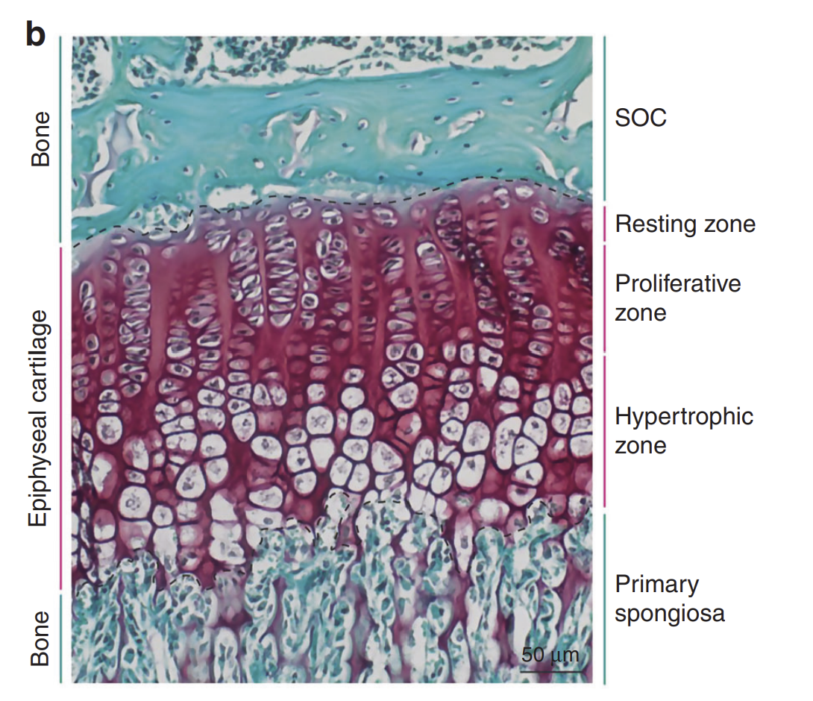
    <p style="font-style: italic; font-size: 0.9em;">(a) 학술 논문 기준 성장판 zone 구분 [1]</p>
  </div>
  <div style="flex: 1; text-align: center;">
    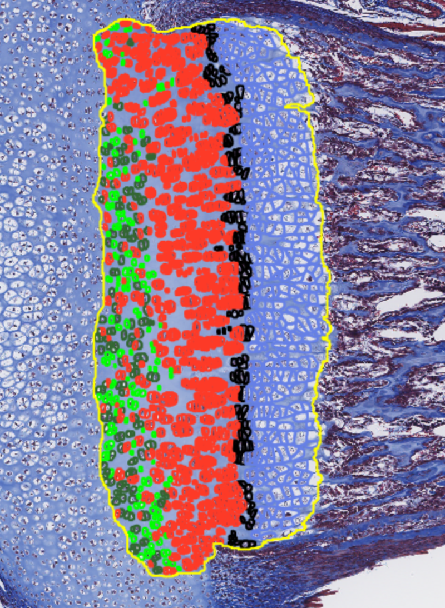
    <p style="font-style: italic; font-size: 0.9em;">(b) 본 연구 QuPath 라벨링 예시</p>
  </div>
</div>

**그림 1.** 성장판 zone 구조(a)와 본 연구의 5-class 라벨링 결과(b). Undetermined 클래스 2개는 인접 zone 경계에 위치하는 전이 세포를 별도로 구분하기 위해 추가하였다.

| 클래스 | 라벨링 색깔 | 성장판 내 위치 | 형태적 특징 |
|---|---|---|---|
| **Resting** | 연두색 | 성장판 상부 | 작고 둥근 형태, 불규칙 배열 |
| **Undetermined_2** | 검정색 | Proliferative ↔ Resting 경계 | 두 zone 사이에서 분류 애매 |
| **Proliferative** | 빨간색 | 성장판 중부 | 납작하고 기둥형 배열 |
| **Undetermined_1** | 진초록색 | Hypertrophic ↔ Proliferative 경계 | 두 zone 사이 transition 세포 |
| **Hypertrophic** | 파란색 | 성장판 하부 | 크고 둥근 형태, 기둥형 배열 |


**표 1.** 분류 대상 5개 클래스 요약. 학술계 표준 3-zone 체계에 경계 세포 2개 클래스를 추가하였다.

---

## 2. 데이터 및 전처리

### 2-1. 원본 데이터

- WSI(Whole Slide Image) `.svs` 파일 총 11장
- 모두 마우스 Tibia 조직, Masson 염색(Masson's trichrome stain)

### 2-2. 데이터 분할 (Data Split)

| 세트 | 파일 번호 | 비율 |
|---|---|---|
| Train | 1, 3, 4, 5, 6, 7 | ~60% |
| Validation | 2, 8 | ~20% |
| Test (hold-out) | 10, 11 | ~20% |

**표 2.** Train / Validation / Test 세트 분할 현황.

> **왜 파일 단위로 분할했나?** WSI 한 장 안의 세포들은 같은 조직에서 나온 것이라 서로 유사하다. 파일을 섞어서 무작위 분할하면(random split) 같은 조직의 세포가 train과 test에 동시에 들어가 **data leakage**(정보 유출)가 발생한다. 즉, 모델이 "실제로 새로운 데이터를 보는 것"이 아니라 "이미 본 조직의 다른 세포를 맞추는 것"이 되어 성능이 과대평가된다.

### 2-3. 세포 검출 및 라벨링 파이프라인

```
WSI (.svs) 파일
    ↓
QuPath로 열기
    ↓
QuPath Extension SAM으로 Growth Plate ROI 설정
    ↓
QuPath Cellpose Extension으로 세포 Detection
    ↓
수동 Annotation (라벨링)
    - Train/Val (1~9): Junha 담당
    - Test (10~11): Jaeseon 담당
    - 5개 클래스로 애매한 세포 → 'Uncertain' 처리 후 제거
    ↓
QuPath로 feature 추출 → CSV 저장 (features_1.csv ~ features_9.csv)
```

**그림 3.** WSI 원본에서 세포 검출, 수동 라벨링, feature 추출까지의 전체 파이프라인.

**사용 소프트웨어**
- QuPath [2]: 디지털 병리 이미지 분석 오픈소스 소프트웨어. 다양한 extension 지원. ([qupath.github.io](https://qupath.github.io/))
- QuPath Extension SAM [3]: https://github.com/ksugar/qupath-extension-sam
- QuPath Cellpose Extension [4,5]: https://github.com/BIOP/qupath-extension-cellpose

### 2-4. 추출된 기본 Feature 목록

| 카테고리 | Feature |
|---|---|
| **메타** | Source_File, Classification |
| **위치** | Centroid X µm, Centroid Y µm |
| **형태** | Area µm², Length µm, Perimeter µm, Circularity, Solidity, Max diameter µm, Min diameter µm |
| **염색(Hematoxylin)** | Mean, Median, Min, Max, Std.Dev. |
| **염색(DAB)** | Mean, Median, Min, Max, Std.Dev. |

**표 3.** QuPath에서 추출된 기본 feature 목록 (총 21개).

---

## 3. Feature Engineering

### 3-1. 추가한 Feature

위 예시 QuPath 사진(그림 1)을 보면, 성장판이 가로 방향으로 놓여 있고 **X 좌표가 커질수록(오른쪽으로 갈수록) Hypertrophic zone**이 위치함을 확인할 수 있다. 이 방향성을 수치화하기 위해 Relative_Pos_X를 추가하였다.

| Feature | 계산식 | 추가 이유 |
|---|---|---|
| **Relative_Pos_X** | (X − min) / (max − min) | 각 슬라이드마다 성장판 절대 위치가 달라 0~1로 정규화한 상대 위치 사용. Resting → Hypertrophic 방향으로 값이 커짐 |
| **AR** (Aspect Ratio) | Max diameter / Min diameter | 세포 납작한 정도(elongation) 반영 |
| **Eccentricity** (Feret-approx) | c/a (단, a = Max/2, b = Min/2, c = √(a²−b²)) | 세포가 원형에서 얼마나 벗어났는지 반영 |

**표 4.** 새로 추가한 engineered feature 3개 및 도입 근거.

### 3-2. 제거한 Feature

| 제거 Feature | 이유 |
|---|---|
| Centroid X µm, Centroid Y µm | Relative_Pos_X로 대체 |
| Max diameter µm, Hematoxylin: Median, Perimeter µm | 다른 feature와 상관계수 ≥ 0.95 → 다중공선성 제거 |

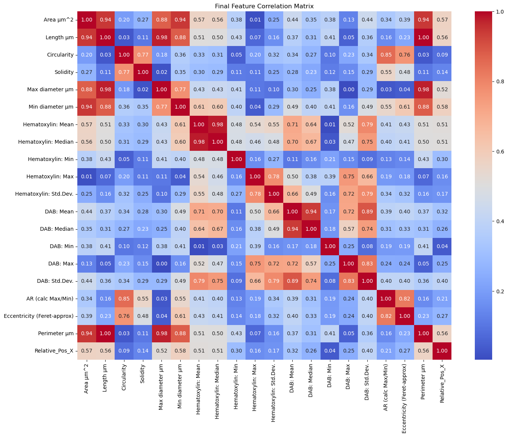

**그림 4.** Feature 간 상관관계 히트맵. 붉은색(r ≥ 0.95) 쌍에서 중복 feature를 제거하여 최종 17개를 확정하였다.

**최종 사용 Feature 수: 19개** (21 - 5 + 3개)

---

## 4. EDA (탐색적 데이터 분석)

### 4-1. 클래스별 위치 분포


**그림 5.** 클래스별 Relative_Pos_X 분포 (Box Plot). X축은 0(왼쪽 끝) ~ 1(오른쪽 끝)로 정규화된 성장판 내 상대 위치를 나타낸다.

- Resting → Undetermined_2 → Proliferative → Undetermined_1 → Hypertrophic 순으로 Relative_Pos_X 값이 커지는 패턴 확인 → **생물학적 zone 구조와 일치**
- Resting과 Undetermined_2는 분포가 유사 (중앙값 모두 ~0.2) → 두 클래스 간 위치만으로는 분류가 어려울 것으로 예상

### 4-2. 클래스 불균형


**그림 6.** 클래스별 세포 수 분포 (히스토그램).

| 클래스 | 세포 수 | 비율 |
|---|---|---|
| Proliferative | 13,993 | 60.9% (가장 많음) |
| Hypertrophic | 5,083 | 22.1% |
| Undetermined_1 | 1,843 | 8.0% |
| Undetermined_2 | 1,792 | 7.8% |
| Resting | 253 | 1.1% (가장 적음) |
| **합계** | **22,964** | **100%** |

**표 5.** 클래스별 세포 수 및 비율.

→ **Proliferative(60.9%) 대 Resting(1.1%)의 약 55배 불균형** → 모델링 시 소수 클래스에 대한 가중치 보정 필요

---

## 5. 모델링

### 5-1. 코드 파일 구조

```
project(gp)/
├── config.py          # 파일 경로, 상수 (RANDOM_STATE=42, TARGET_COL, GROUP_COL)
├── main.py            # train 및 predict 실행
└── src/
    ├── data_loader.py # CSV → X_train, y_train, X_val, y_val 생성
    ├── model_utils.py # 4개 모델 정의 및 평가
    ├── trainer.py     # 학습, 결과 저장 (report, confusion matrix, feature importance, model.pkl)
    └── tuner.py       # 하이퍼파라미터 최적화 (RandomizedSearch + PredefinedSplit)
```

**그림 7.** 프로젝트 코드 파일 구조. 설정·실행·데이터 로딩·모델·학습·튜닝 모듈을 분리하여 관리하였다.

### 5-2. 모델 선정 전략

> 먼저 4개 baseline 모델을 비교 → **Macro F1-score** 기준 최선 모델 선정 → 해당 모델 하이퍼파라미터 최적화

| 지표 | 의미 |
|---|---|
| **Precision** (정밀도) | 모델이 A라고 예측한 것 중 실제로 A인 비율. "예측의 정확성" |
| **Recall** (재현율) | 실제 A인 것 중 모델이 A라고 맞춘 비율. "탐지율" |
| **F1-score** | Precision과 Recall의 조화평균. 둘 다 고려한 종합 지표 |
| **Accuracy** | 전체 예측 중 맞춘 비율. 클래스 불균형 시 신뢰도 낮음 |
| **Macro F1** | 각 클래스의 F1-score를 단순 평균. 소수 클래스도 동등하게 반영 |

**표 6.** 평가 지표 용어 설명.

**Macro F1-score 선택 이유:** 클래스 불균형 상황에서 accuracy는 다수 클래스에 치우침 (예: Proliferative만 잘 맞춰도 accuracy ~61%). Macro F1은 클래스 수로 단순 평균하므로 Resting(1.1%)도 Proliferative(60.9%)와 동등한 가중치를 가짐.

### 5-3. 4개 모델 설명

| 모델 ID | 알고리즘 | 클래스 불균형 처리 |
|---|---|---|
| 01_rf_baseline | Random Forest | 없음 (default) |
| 02_xgb_baseline | XGBoost | 없음 (default) |
| 03_rf_balanced | Random Forest | `class_weight='balanced'` |
| 04_xgb_balanced | XGBoost | 학습 시 샘플 가중치 직접 계산·적용 |

**표 7.** 비교 대상 4개 baseline 모델. 동일 알고리즘(RF/XGB) 내에서 클래스 불균형 처리 유무를 변수로 비교하였다.

> **Random Forest란? [6]** 여러 개의 결정 트리(decision tree)를 무작위로 만들어 다수결 투표로 예측하는 앙상블 모델. 테이블 형태 데이터에서 강하고, feature 스케일링 불필요.

> **XGBoost란? [7]** 이전 트리가 틀린 부분을 다음 트리가 보완하는 방식으로 순차적으로 트리를 쌓는(Gradient Boosting) 앙상블 모델. Random Forest보다 정밀하지만 하이퍼파라미터 튜닝이 중요.

> **XGBoost 클래스 불균형 처리 방식:** XGBoost는 모델 생성 시(`class_weight` 인자)가 아니라 **학습 시** `sample_weight`를 통해 가중치를 부여해야 함. 각 클래스의 역빈도(inverse frequency)로 가중치 계산 후 `fit()` 시 전달.

> **구현 라이브러리: Scikit-learn [8]** 본 연구의 모든 모델 학습, 평가(classification report, confusion matrix), 하이퍼파라미터 탐색(RandomizedSearchCV)은 Python 머신러닝 라이브러리인 Scikit-learn을 통해 구현하였다. XGBoost 모델은 Scikit-learn API와 호환되는 `XGBClassifier`를 사용하였다.

---

## 6. 실험 결과

### 6-1. Classification Report 비교 (4개 모델)

| | 01_rf_baseline | 02_xgb_baseline | 03_rf_balanced | 04_xgb_balanced |
|---|---|---|---|---|
| **Accuracy** | 0.859 | 0.848 | 0.854 | 0.838 |
| **Macro F1** | **0.648** | **0.644** | **0.626** | **0.679** |
| Resting F1 | 0.526 | 0.539 | 0.550 | 0.611 |
| Undetermined_2 F1 | 0.484 | 0.469 | 0.437 | 0.479 |
| Proliferative F1 | 0.915 | 0.910 | 0.909 | 0.904 |
| Undetermined_1 F1 | 0.380 | 0.378 | 0.298 | 0.481 |
| Hypertrophic F1 | 0.935 | 0.922 | 0.935 | 0.919 |

**표 8.** 모델별 성능 비교 (Validation set 기준).

→ **Macro F1 기준 04_xgb_balanced(0.679)가 최우수.** 가중치 보정(03, 04) 적용 시 소수 클래스(Resting, Undetermined_1, Undetermined_2)의 recall이 개선되는 반면, 다수 클래스(Proliferative, Hypertrophic)의 precision은 소폭 하락한다. 이는 소수 클래스를 더 잘 맞추기 위해 다수 클래스 일부를 희생하는 trade-off이며, Macro F1 관점에서는 유리한 방향이다.

### 6-2. Confusion Matrix 분석 (4개 모델)

<div style="display: grid; grid-template-columns: 1fr 1fr; gap: 12px;">
  <div style="text-align: center;">
    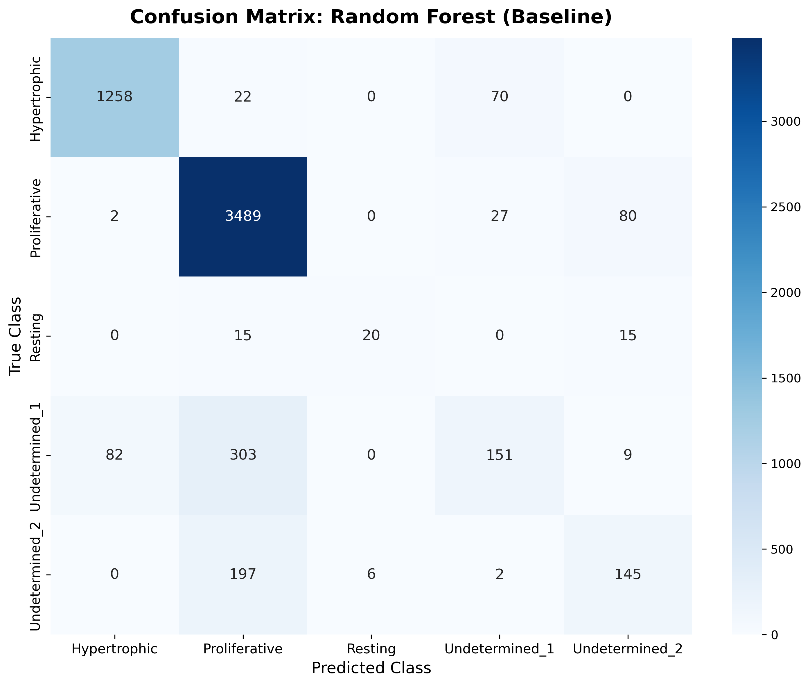
    <p style="font-style: italic; font-size: 0.9em;">(a) 01_rf_baseline</p>
  </div>
  <div style="text-align: center;">
    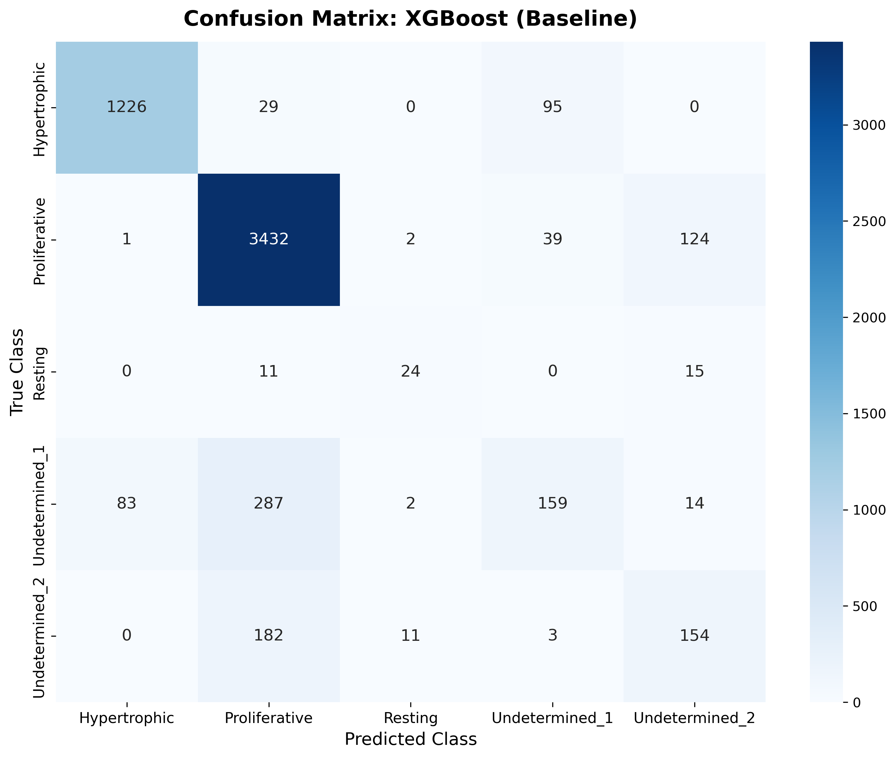
    <p style="font-style: italic; font-size: 0.9em;">(b) 02_xgb_baseline</p>
  </div>
  <div style="text-align: center;">
    
    <p style="font-style: italic; font-size: 0.9em;">(c) 03_rf_balanced</p>
  </div>
  <div style="text-align: center;">
    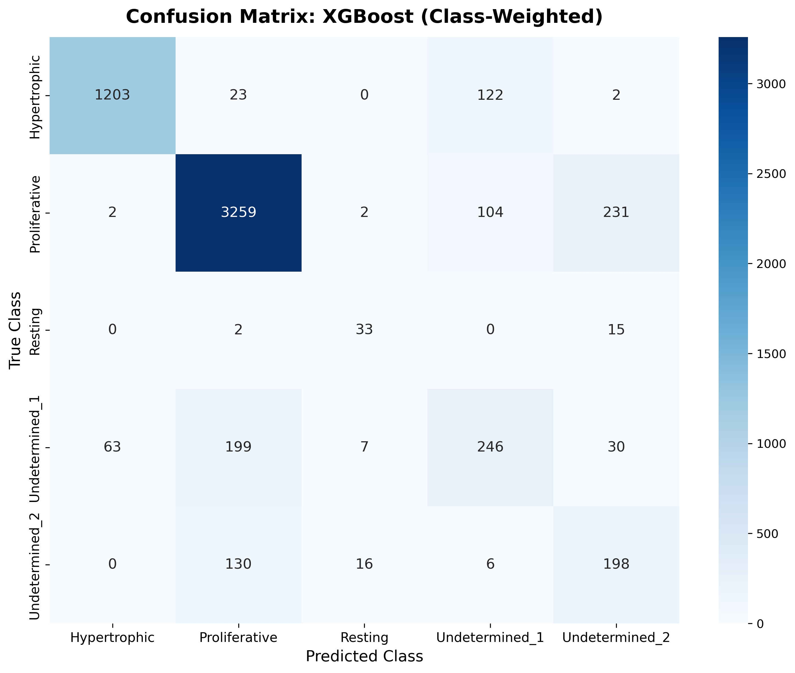
    <p style="font-style: italic; font-size: 0.9em;">(d) 04_xgb_balanced</p>
  </div>
</div>

**그림 8.** 모델별 Confusion Matrix 비교. 행(row)은 실제 클래스, 열(column)은 예측 클래스이며 대각선이 정분류를 나타낸다.

공통적으로 나타나는 패턴:
- Hypertrophic, Proliferative는 모든 모델에서 높은 정확도 (대각선 값 큼)
- Resting은 Proliferative나 Undetermined_2로 오분류되는 경향 (수가 적어 학습 부족)
- Undetermined_1은 Proliferative 또는 Hypertrophic으로 오분류 → transition zone의 본질적 모호성
- Undetermined_2는 Proliferative 또는 Resting으로 오분류 → 역시 경계 zone의 특성

가중치 보정 후(c, d): Resting과 Undetermined 클래스의 대각선 값이 개선되나, Proliferative 행에서 오분류 수가 소폭 증가한다.

### 6-3. Feature Importance 분석 (4개 모델)

<div style="display: grid; grid-template-columns: 1fr 1fr; gap: 12px;">
  <div style="text-align: center;">
    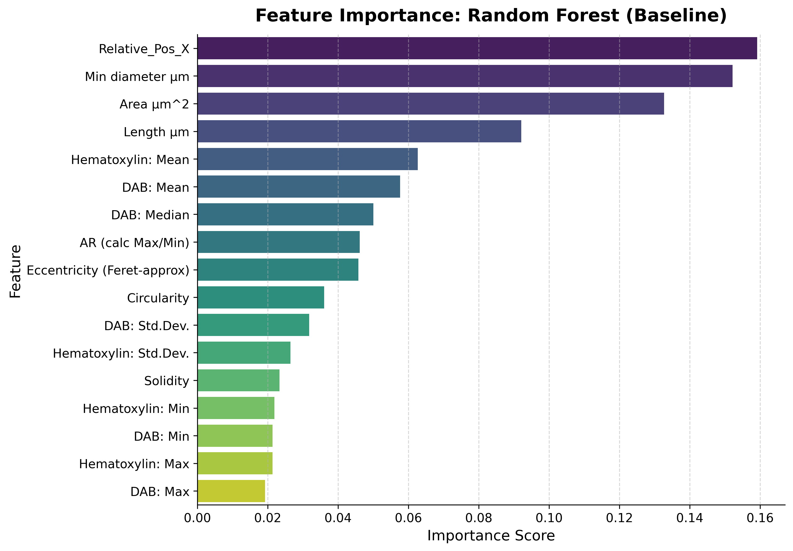
    <p style="font-style: italic; font-size: 0.9em;">(a) 01_rf_baseline</p>
  </div>
  <div style="text-align: center;">
    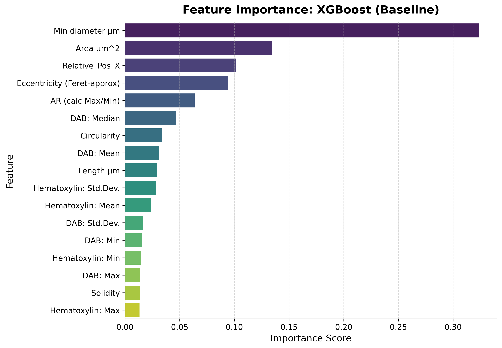
    <p style="font-style: italic; font-size: 0.9em;">(b) 02_xgb_baseline</p>
  </div>
  <div style="text-align: center;">
    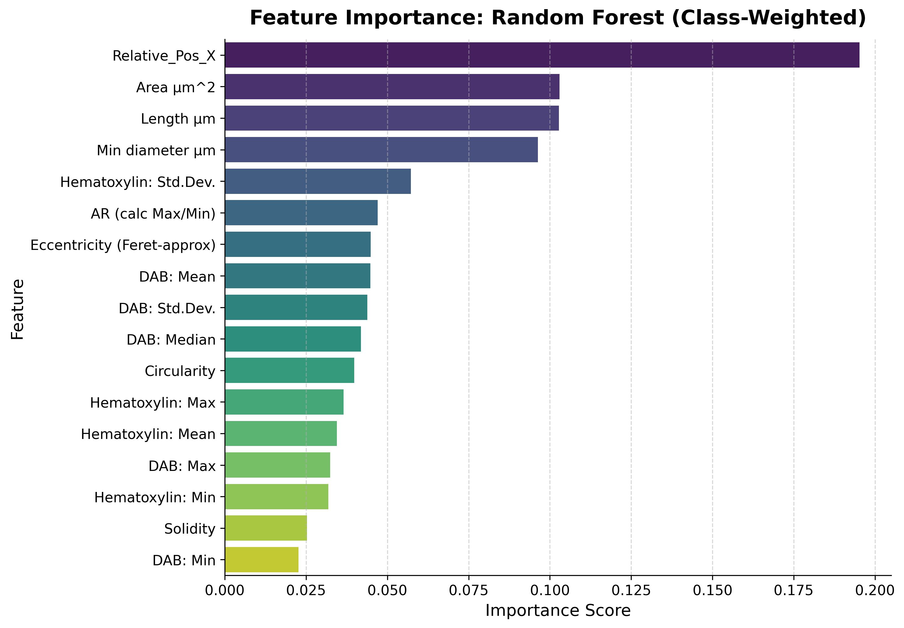
    <p style="font-style: italic; font-size: 0.9em;">(c) 03_rf_balanced</p>
  </div>
  <div style="text-align: center;">
    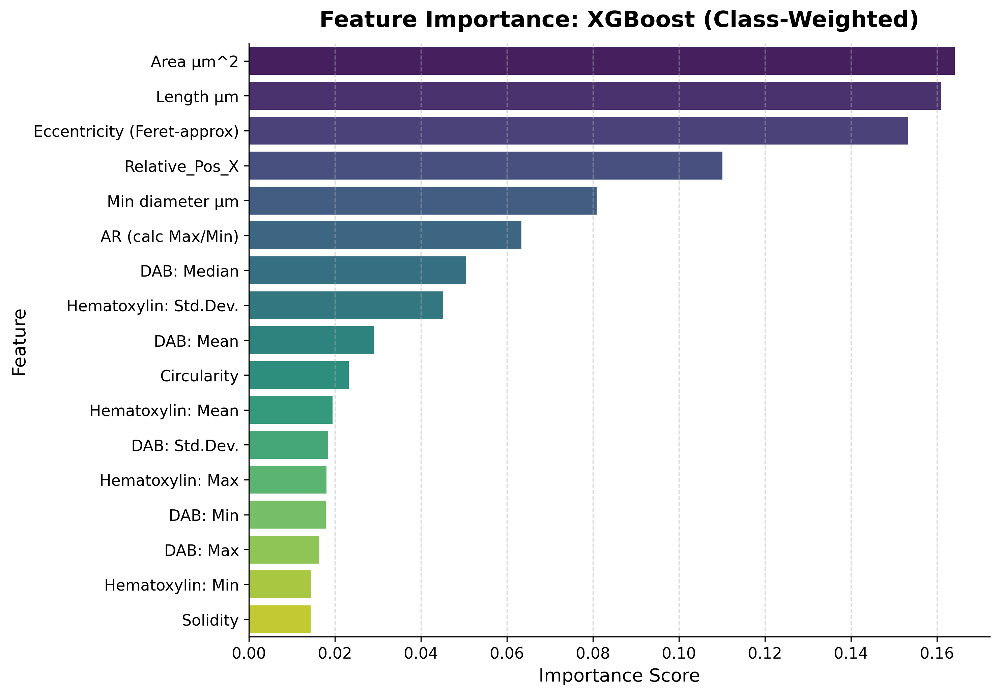
    <p style="font-style: italic; font-size: 0.9em;">(d) 04_xgb_balanced</p>
  </div>
</div>

**그림 9.** 모델별 Feature Importance 비교.

| 모델 | 상위 중요 Feature |
|---|---|
| 01_rf_baseline | Relative_Pos_X, Min diameter, Area |
| 02_xgb_baseline | Min diameter, Area, Relative_Pos_X |
| 03_rf_balanced | Relative_Pos_X, Area, Length |
| 04_xgb_balanced | Area, Length, Eccentricity |

**표 9.** 모델별 상위 3개 중요 feature.

→ **Position(Relative_Pos_X)와 Size(Area, Min diameter, Length 등) 관련 feature가 모든 모델에서 일관되게 중요.** 가중치 보정 후(c, d) Eccentricity(세포 형태의 타원형 정도)의 중요도가 상승하며, 소수 클래스 분류에 shape feature가 더 활발히 활용됨을 시사한다.

---

## 7. 하이퍼파라미터 최적화 (05_xgb_tuned)

### 7-1. 최적화 방법: Randomized Search

**RandomizedSearch란?** Grid Search(모든 조합 탐색)와 달리, 지정된 탐색 범위(search space) 내에서 **n_iter번** 무작위로 조합을 뽑아 평가. 속도가 빠르고 넓은 범위 탐색에 적합.

- `n_iter = 100`: 무작위 조합 100가지를 시도
- 평가 기준: Macro F1-score
- 데이터 분할: PredefinedSplit으로 train/val 7:2 비율 고정 유지

### 7-2. 탐색 범위 (Search Space)

```python
{
    'n_estimators': [100, 200, 300, 500],
    'max_depth': [3, 5, 7, 9],
    'learning_rate': [0.01, 0.05, 0.1, 0.2],
    'subsample': [0.6, 0.8, 1.0],
    'colsample_bytree': [0.6, 0.8, 1.0],
    'gamma': [0, 0.1, 0.2]
}
```

### 7-3. 최적 하이퍼파라미터 비교

| 파라미터 | 기본값 | 최적값 | 의미 |
|---|---|---|---|
| `n_estimators` | 100 | **500** | 트리를 5배 더 많이 → 학습량 증가 |
| `max_depth` | 6 | **9** | 트리를 더 깊게 → 복잡한 패턴 학습 |
| `learning_rate` | 0.3 | **0.1** | 학습 속도 낮춤 → 더 정교한 최적화 |
| `gamma` | 0 | **0.2** | 노드 분할 최소 조건 강화 → 과적합 방지 |
| `colsample_bytree` | 1.0 | **0.6** | 트리당 feature 60%만 사용 → 과적합 방지 |
| `subsample` | 1.0 | 1.0 | 변화 없음 |

**표 10.** 기본값 대비 최적 하이퍼파라미터. 표현력 증가(n_estimators↑, max_depth↑)와 과적합 억제(gamma↑, colsample_bytree↓)가 동시에 이루어진 방향으로 최적화되었다.

**최고 Macro F1 (validation):** 0.7023

### 7-4. 04_xgb_balanced vs. 05_xgb_tuned 비교

| | 04_xgb_balanced | 05_xgb_tuned | 변화 |
|---|---|---|---|
| **Accuracy** | 0.838 | 0.853 | +0.015 |
| **Macro F1** | 0.679 | **0.702** | **+0.023** |
| Resting F1 | 0.611 | 0.648 | +0.037 |
| Undetermined_2 F1 | 0.479 | 0.521 | +0.042 |
| Proliferative F1 | 0.904 | 0.914 | +0.010 |
| Undetermined_1 F1 | 0.481 | 0.504 | +0.023 |
| Hypertrophic F1 | 0.919 | 0.924 | +0.005 |

**표 11.** 튜닝 전후 성능 비교. 전 클래스에 걸쳐 F1이 고르게 향상되었으며, 소수 클래스(Resting +0.037, Undetermined_2 +0.042)의 개선 폭이 특히 크다.

<div style="display: flex; gap: 12px; align-items: flex-start;">
  <div style="flex: 1; text-align: center;">
    
    <p style="font-style: italic; font-size: 0.9em;">(a) Confusion Matrix</p>
  </div>
  <div style="flex: 1; text-align: center;">
    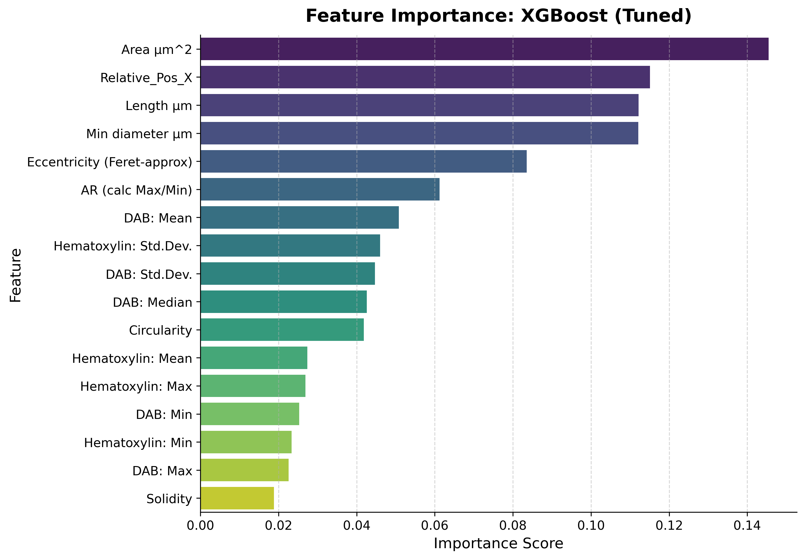
    <p style="font-style: italic; font-size: 0.9em;">(b) Feature Importance</p>
  </div>
</div>

**그림 10.** 05_xgb_tuned의 Confusion Matrix(a)와 Feature Importance(b). 04_xgb_balanced 대비 Resting·Undetermined 클래스의 대각선 값이 전반적으로 개선되었으며, Area·Relative_Pos_X·Length·Min diameter가 여전히 상위 feature를 차지한다.

---

## 8. 최종 테스트 결과 (FINAL_TEST_RESULT)

### 8-1. 테스트 설정

- 테스트 데이터: features_10.csv, features_11.csv (완전한 hold-out, 모델 학습에 사용하지 않음)
- 사용 모델: 05_xgb_tuned (학습된 가중치 불러옴, `.pkl`)
- 전처리: 동일한 feature engineering 및 결측치 처리 적용

### 8-2. 최종 성능

| | 05_xgb_tuned (val) | FINAL_TEST (test) | 차이 |
|---|---|---|---|
| **Accuracy** | 0.853 | 0.862 | +0.009 |
| **Macro F1** | 0.702 | **0.706** | +0.004 |
| Resting F1 | 0.648 | 0.591 | −0.057 |
| Undetermined_2 F1 | 0.521 | 0.603 | +0.082 |
| Proliferative F1 | 0.914 | 0.926 | +0.012 |
| Undetermined_1 F1 | 0.504 | 0.524 | +0.020 |
| Hypertrophic F1 | 0.924 | 0.888 | −0.036 |

**표 12.** Validation 대비 최종 Test 성능 비교.

<div style="display: flex; gap: 12px; align-items: flex-start;">
  <div style="flex: 1; text-align: center;">
    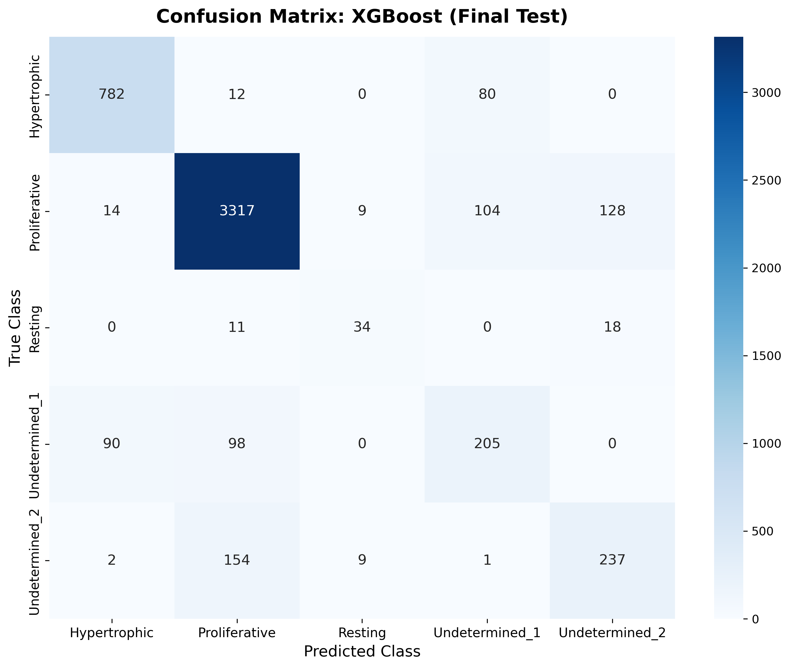
    <p style="font-style: italic; font-size: 0.9em;">(a) Confusion Matrix</p>
  </div>
  <div style="flex: 1; text-align: center;">
    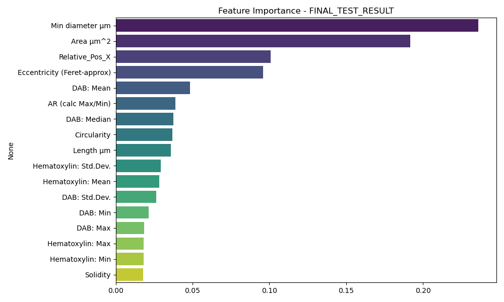
    <p style="font-style: italic; font-size: 0.9em;">(b) Feature Importance</p>
  </div>
</div>

**그림 11.** 최종 테스트 결과의 Confusion Matrix(a)와 Feature Importance(b).

**해석:**
- 전체 Macro F1은 validation과 유사 (0.702 → 0.706) → **과적합 없이 일반화됨**
- Undetermined_2 F1이 크게 향상(+0.082): test 세트의 Undetermined_2 분포가 학습 데이터와 잘 맞았을 가능성
- Resting F1 소폭 하락(−0.057): 테스트 슬라이드(10, 11)의 Resting 세포 수가 적고 분포가 달라 어려움 예상
- Hypertrophic F1 하락(−0.036): train annotator(Junha)와 test annotator(Jaeseon)의 라벨링 기준 차이에서 비롯된 inter-annotator variability의 영향으로 해석됨. 단, 이는 train/test annotator를 의도적으로 다르게 설정한 것으로, 보다 엄격하고 현실적인 평가 설계임.

### 8-3. QuPath Visualization (정성적 평가)

**색상 범례:**

| 클래스 | 색상 |
|---|---|
| Resting | 연두색 |
| Undetermined_2 | 검정색 |
| Proliferative | 빨간색 |
| Undetermined_1 | 진초록색 |
| Hypertrophic | 파란색 |
| Uncertain (Original에서만) | 하늘색 |
| None / 미분류 (Test에서만) | 보라색 |

**표 13.** QuPath Visualization 색상 범례. Original(수동 라벨링)과 Test(모델 예측)에 동일한 색상 체계를 적용하여 비교하였다.

<div style="display: flex; gap: 12px; align-items: flex-start;">
  <div style="flex: 1; text-align: center;">
    
    <p style="font-style: italic; font-size: 0.9em;">(a) 수동 라벨링 (Original)</p>
  </div>
  <div style="flex: 1; text-align: center;">
    
    <p style="font-style: italic; font-size: 0.9em;">(b) 모델 예측 (Test)</p>
  </div>
</div>

**그림 12.** Slide 10 비교.

<div style="display: flex; gap: 12px; align-items: flex-start;">
  <div style="flex: 1; text-align: center;">
    
    <p style="font-style: italic; font-size: 0.9em;">(a) 수동 라벨링 (Original)</p>
  </div>
  <div style="flex: 1; text-align: center;">
    
    <p style="font-style: italic; font-size: 0.9em;">(b) 모델 예측 (Test)</p>
  </div>
</div>

**그림 13.** Slide 11 비교.

**해석 (Slide 10, 11 공통):**
- 전반적으로 성장판의 zone 구조(Resting → Proliferative → Hypertrophic)가 공간적으로 유지됨 → 모델이 zone의 위상(topology)을 학습하였음을 시사
- 경계 영역(Undetermined)에서 예측 불일치가 주로 발생 → 본질적으로 모호한 세포이므로 허용 가능한 오류
- 보라색(None)으로 표시된 세포는 결측치 또는 Uncertain 처리된 세포에 해당

---

## 9. 결론 및 향후 과제

### 9-1. 결론
- XGBoost + 클래스 가중치 보정 + 하이퍼파라미터 최적화(05_xgb_tuned)가 최선
- Macro F1 **0.706** (test set) 달성 → 클래스 불균형 상황에서 전 클래스를 고르게 분류
- 주요 feature: 세포 크기(Area, Length, Min diameter, Eccentricity, AR 등)와 성장판 내 상대적 위치(Relative_Pos_X)

### 9-2. 한계 및 향후 과제
- **Resting 클래스 데이터 부족:** 전체의 1.1%(253개)에 불과 → 추가 데이터 확보 또는 synthetic oversampling(SMOTE 등) 고려
- **Inter-annotator variability:** Train(Junha)과 Test(Jaeseon) annotator 다름 → inter-annotator agreement 정량화 필요 (예: Cohen's Kappa)
- **데이터 이질성 미통제:** 현재 데이터는 young/old, 정상(wildtype)/mutation 등 서로 다른 조건의 마우스 샘플이 혼재되어 있음. 이를 구분하지 않고 학습한 모델은 조건 간 생물학적 차이를 학습하지 못할 수 있으며, 향후 조건별로 층화(stratified) 분석이 필요
- **이미지 pixel 정보 미활용:** 본 연구는 QuPath에서 추출한 형태 및 염색 통계 feature만 사용하였다. 향후 각 세포 주변의 이미지 패치(image patch)를 잘라내어 CNN(Convolutional Neural Network) 기반 모델에 입력하면, 수작업으로 정의하기 어려운 공간적·텍스처 정보까지 학습할 수 있을 것으로 기대된다. 이를 위해선 더 많은 computing power가 필요하다. 
- **단일 뼈(tibia)만 분석:** 다른 long bone으로 일반화 여부 미검증

---

*References:*

1. Chagin, A.S. & Newton, P.T. Postnatal skeletal growth is driven by the epiphyseal stem cell niche: potential implications to pediatrics. *Pediatric Research* 87, 986–990 (2020). https://doi.org/10.1038/s41390-019-0722-z
2. Bankhead, P. et al. QuPath: Open source software for digital pathology image analysis. *Scientific Reports* (2017). https://doi.org/10.1038/s41598-017-17204-5
3. Sugawara, K. Training deep learning models for cell image segmentation with sparse annotations. *bioRxiv* 2023.06.13.544786 (2023). https://doi.org/10.1101/2023.06.13.544786
4. Hérent, C. et al. QuPath Cellpose Extension. Zenodo (2023). https://doi.org/10.5281/zenodo.7704271
5. Stringer, C. et al. Cellpose: a generalist algorithm for cellular segmentation. *Nature Methods* 18, 100–106 (2021). https://doi.org/10.1038/s41592-020-01018-x
6. Breiman, L. Random Forests. *Machine Learning* 45, 5–32 (2001). https://doi.org/10.1023/A:1010933404324
7. Chen, T. & Guestrin, C. XGBoost: A Scalable Tree Boosting System. *Proceedings of the 22nd ACM SIGKDD* (2016). https://doi.org/10.1145/2939672.2939785
8. Pedregosa, F. et al. Scikit-learn: Machine Learning in Python. *Journal of Machine Learning Research* 12, 2825–2830 (2011). http://jmlr.org/papers/v12/pedregosa11a.html